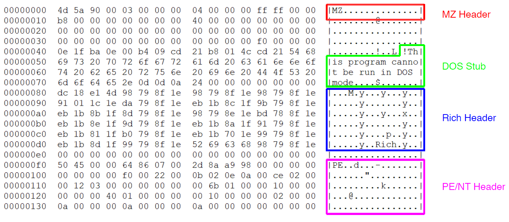
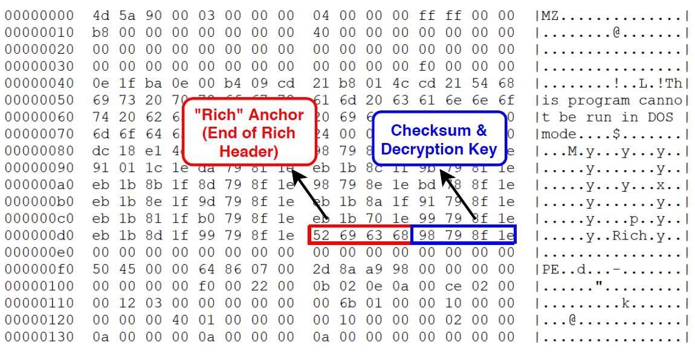
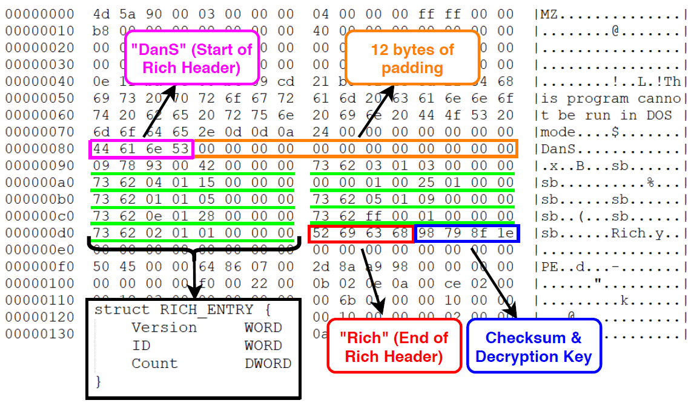

# PE_Richness

Collection of scripts used to investigate the PE Rich Header in support of malware detection and linking. Originally developed while conducting research into the Rich Header. 

https://www.sans.org/reading-room/whitepapers/reverseengineeringmalware/leveraging-pe-rich-header-static-malware-detection-linking-39045

## A Rich Header Intro

The Rich header is an undocumented section in the portable executable header that exists as a result of the compilation and build process of Microsoft-produced portable executables. The information stored in this header section provides a window into the environment where an executable was built. This header section exists in plain sight and directly follows the MZ file header and DOS Stub. 



It has received its name due to its defining marker, the presence of the hexadecimal bytes `0x52696368` or the ascii text `Rich`. This byte sequence acts as an anchor and marks the end of the section.



The content of the header itself is encrypted and obfuscated. Located directly after Rich is a 32-bit checksum and decryption key. During the creation of the Rich header this checksum is derived and then XORed with each 4-byte chunk, providing an elementary means of encrypting the section's contents. Fortunately, it is trivial to extract the checksum and decrypt the rest of the Rich header. In order to derive the decrypted contents of the Rich header the key identified after the Rich string is XORed with each proceeding DWORD until the ascii string `DanS` is observed. Just as `Rich` identifies the end of the Rich header, `DanS` or `0x44616e53` is the marker of its beginning.

The body of the Rich header is comprised of single array that stores metadata on each step of the build chain during the linking of objects into a single executable. The array is variable in length and made up of an 8-byte structure. The structure contains the product identification (pID), product version (pV), and a count (pC) of each time the product was used; the total number of source files compiled. The first two bytes account for the pV, the second two for the pID, and the final four for the pC. The values exist in little-endian byte order and must be reversed to big-endian in order to be understood correctly. Due to the nature of the Rich header being an unofficial and undocumented PE section, there is no official comprehensive mapping of pID to Microsoft products.




## Parsing the Rich Header in Python 
Decodes Rich Header content and extracts product id, product version, and count. Requires python pefile for parsing of the PE file format.


Usage:

    $ python parseRich.py </path/to/PE>

Sample Output:
```
$ python parseRich.py samples/06cd99f0f9f152655469156059a8ea25 | jq .
{
  "Rich Header": [
    {
      "Product_Count": 62,
      "Product_Version": 9044,
      "Product_ID": 48
    },
    {
      "Product_Count": 6,
      "Product_Version": 7291,
      "Product_ID": 12
    },
   ...
   ...
   ...
    {
      "Product_Count": 12,
      "Product_Version": 9782,
      "Product_ID": 11
    }
  ],
  "Rich Hashes": {
    "Rich Hash": "e06d109762445c31877c719587e9127e",
    "Rich PV": "d19ad1ceca9c94f238dac4ab0e9cb30c"
  }
}
```


## Dynamically generating Yara rules
Generates Yara rules based on Rich and RichPV hash content. Requires python pefile for parsing of the PE file format.

Usage:

```
$ python richYara.py </path/to/PE>
```

Sample Output:
```
$ python richYara.py samples/06cd99f0f9f152655469156059a8ea25
import "hash"
import "pe"
rule RichHash
{
        meta:
                description="Ref: 06cd99f0f9f152655469156059a8ea25"
        condition:
                uint16(0x00) == 0x5a4d and
                hash.md5(pe.rich_signature.clear_data) == "e06d109762445c31877c719587e9127e"

}
import "pe"
rule RichPV
{
        meta:
                description="Ref: 06cd99f0f9f152655469156059a8ea25"
        condition:
                uint16(0x00) == 0x5a4d and
                pe.rich_signature.toolid(48, 9044) and
                pe.rich_signature.toolid(12, 7291) and
                pe.rich_signature.toolid(10, 8047) and
                pe.rich_signature.toolid(4, 8047) and
                pe.rich_signature.toolid(14, 7299) and
                pe.rich_signature.toolid(93, 4035) and
                pe.rich_signature.toolid(1, 0) and
                pe.rich_signature.toolid(10, 9782) and
                pe.rich_signature.toolid(11, 9782)
}
```
